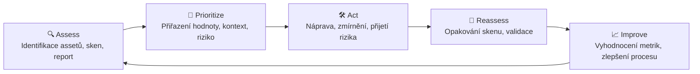
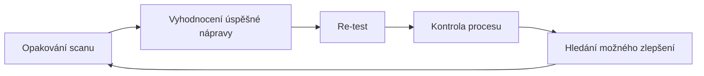

# Management technických zranitelností

---
layout: default
---

# Proč by vás VM měl zajímat?

- Jasně definované procesy: **sken → report → patch → opakuj**
- Měřitelné výsledky: počet zranitelností, čas na opravu
- Spolupráce napříč firmou: IT, vývoj, management

Typické úkoly VM specialistky:
- Spouštění skenů, analýza výsledků, filtrování false positives
- Prioritizace zranitelností, koordinace s IT týmy
- Reporting pro management

---
layout: default
---

# Co je to technická zranitelnost?

- Chyby v kódech
- Špatná konfigurace operačních systémů (slabé heslo, otevřené porty, špatně nastavená oprávnění)
- Slabiny v komunikačních protokolech (např. Telnet port 23)
- Slabiny v knihovnách třetích stran, které se importují do vlastních systémů

---
layout: default
---

# Přípravné kroky k zavedení VM

- **IT Asset inventory**
  - hardware – servery, laptopy, desktopy, telefony
  - software – operační systém, aplikace, jejich verze, vydavatelé
  - kdo jsou „asset owners"
- **Role a odpovědnosti** vzhledem k jednotlivým částem procesu
  - monitoring zranitelností
  - risk assessment zranitelností
  - instalace updatů či zavedení jiného opatření
- **Výběr skenovacího zařízení** na základě počtu a druhu zařízení
- **Frekvence skenování** – jak často se zařízení budou skenovat?

---
layout: default
---

# Vulnerability Management – aktuální čísla

  

    
📈

    
<strong>Exploze počtu zranitelností</strong> 2023: 28 961 nových CVE → 2024: 40 009 CVE (rekord!). Celkem evidováno přes 230 000 známých zranitelností.

  

  

    
⚡

    
<strong>Útočníci jsou rychlejší</strong> 28 % zranitelností je zneužito do 24 hodin od zveřejnění. V roce 2024 bylo poprvé zneužito 768 CVE (+20 % oproti 2023).

  

  

    
🎯

    
<strong>Trend: Risk-Based VM (RBVM)</strong> Ne „opravíme vše s vysokým CVSS", ale „co nás reálně ohrožuje".

  

RBVM kombinuje CVSS (technickou závažnost), EPSS (pravděpodobnost zneužití) a kontext (je systém na internetu? má citlivá data?).

---
layout: default
---

# Vulnerability Management Lifecycle

Zdroj: [crowdstrike.com – Vulnerability Management Lifecycle](https://www.crowdstrike.com/cybersecurity-101/vulnerability-management/vulnerability-management-lifecycle/)

---
layout: default
---

# Assets

1. Identifikace assetů (v souladu s asset inventory)
   - jaká data jsou na daných zařízeních zpracována?
   - je systém vystaven na internetu?
   - je systém v produkčním, testovacím nebo „development" prostředí?
2. Sken těchto assetů – skenovací nástroj porovnává zjištění s databází zranitelností
3. Reportování nalezených zranitelností

---
layout: default
---

# Pojmy spojené se skenováním

| Pojem | Vysvětlení |
|---|---|
| **Ověřený sken** (Authenticated Scan) | sken probíhá s přihlašovacími údaji do systému |
| **Neověřený sken** (Unauthenticated Scan) | sken probíhá zvenčí, bez přihlašovacích údajů |
| **Falešně pozitivní nález** (False Positive) | nástroj nahlásí zranitelnost, která ve skutečnosti neexistuje |
| **Falešně negativní nález** (False Negative) | nástroj zranitelnost přehlédne, přestože existuje |

---
layout: default
---

# CVE

- **Common Vulnerabilities and Exposures** – seznam odhalených zranitelností od MITRE
- Na rozdíl od CVSS nehodnotí závažnost
- [CVE vyhledávač](https://cve.mitre.org/cve/search_cve_list.html)

---
layout: default
---

# CVSS

**Common Vulnerability Scoring System** – metoda ke stanovení kvalitativního měřítka závažnosti zranitelnosti.

| Severity | CVSS v2.0 | CVSS v3.x |
|---|---|---|
| None | – | 0.0 |
| Low | 0.0–3.9 | 0.1–3.9 |
| Medium | 4.0–6.9 | 4.0–6.9 |
| High | 7.0–10.0 | 7.0–8.9 |
| Critical | – | 9.0–10.0 |

Zdroj: [nvd.nist.gov/vuln-metrics/cvss](https://nvd.nist.gov/vuln-metrics/cvss) · [CVSS kalkulačka](https://www.first.org/cvss/calculator/4.0)

---
layout: image-right
image: /qualys-trusted-scan.png
---

# Qualys – příklad ověřeného skenu

Ukázka výstupu skenovacího nástroje Qualys: barevné rozlišení nálezů (potvrzená zranitelnost, potenciální zranitelnost, získaná konfigurační data) a detail konkrétního nálezu s CVE ID.

Zdroj: [Qualys Knowledgebase](https://qualysguard.qg2.apps.qualys.com/qwebhelp/fo_portal/knowledgebase/knowledgebase_lp.htm)

---
layout: default
---

# Prioritizace

- Přiřazení hodnoty zranitelnosti
- Zařazení do kontextu celkového pojetí
- Přiřazení rizika

Na základě těchto aspektů se rozhodne:
- jaké zranitelnosti?
- na jakých aktivech (assetech)?
- kdy?
- jak?

---
layout: default
---

# Akce

- **Náprava** (Remediation) – obvykle patch nebo upgrade; nutnost testování mimo produkci
- **Přijetí** (Acceptation) – přijetí rizika
- **Zmírnění** (Mitigation) – přijetí opatření, které útočníkovi ztíží nebo znemožní využít zranitelnost

---
layout: default
---

# Zlepšení

---
layout: default
---

# Nejznámější skenovací nástroje

  

    
🔴

    
Qualys

  

  

    
🟢

    
Tenable Nessus

  

  

    
🐲

    
OpenVAS

  

  

    
🛡️

    
Rapid7 Nexpose

  

  

    
🟠

    
Burp Suite

  

  

    
⚡

    
OWASP ZAP

  

---
layout: default
---

# Skenování webových aplikací

Skener do webové aplikace posílá známé škodlivé vstupy a zkouší, jestli se „dostane" do aplikace.

---
layout: default
---

# Skenování aplikací

- **Statické testování** – analýza kódu bez jeho spuštění, hledání zranitelností
- **Dynamické testování** – spuštění kódu a hledání zranitelností v různých rozhraních (interfaces)
- **Interaktivní testování** – kombinace statického a dynamického testování

---
layout: section
---

# Penetrační testování

---
layout: default
---

# Úkol – přiřazení kontrol k příběhu

Breakout rooms

Velká potravinářská firma má výrobní závody na více místech v ČR. Veškeré činnosti až na vybrané IT služby (SOC team, VM) si zajišťuje svépomocí.

Pokuste se:
- odhadnout hodnocení v jednotlivých kategoriích (A–F)
- určit, ve které oblasti bude firma nejslabší a proč
- popsat, co vás k vašim odhadům vedlo

| Kategorie | Hodnocení (A nejlepší – F nejhorší) |
|---|---|
| **Celkové skóre** | X/100 |
| Network Security | ? |
| DNS Health | ? |
| Patching Cadence | ? |
| Application Security | ? |
| Endpoint Security | ? |

Princip úkolu: nejprve práce ve skupinkách (15 min), poté zástupkyně každé skupiny odprezentuje výstupy ostatním a lektorka s kouči poskytnou feedback.
